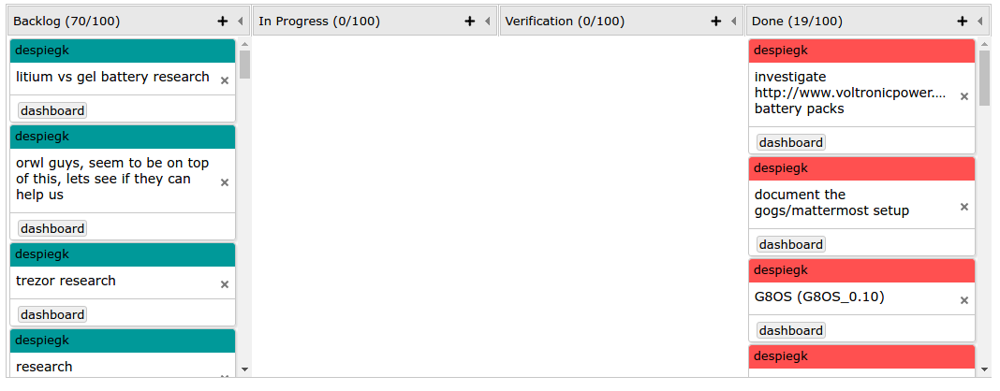

## Displaying Kanban in portal

The data retrived from gogs in the [Migrating Data Models](Walkthrough/Models/Migrating_data_from_gogs.md)
can now be displayed using a macro in portal that allows filtering within the wiki itself.

The macro is called `kanbandata` which allows us to take input specific issues, lables, user and others to filter on.
This is demonstarted below, in the example wiki:
 - The first paramter specifies which source of data to get from in this case `issue`.
 - The second parameter specifies the lables to filter issues on so in this case `priority_critical` and `state_verification`.
 - The third parameter specifies to also filter issues on assigned user with id `1`. Names were avoided as gogs allows duplication of usernames.

```
{{kanbandata:issue label:priority_critical,state_verification assingee:1 }}
```
The filter parameters support all the same paramters as the find method in the collection of each source.
so for example the issue I can filter on :   
    `repo`  repo id   
    `title`  title name   
    `milestone`  milestone id   
    `isClosed`  true or false   
    `id`  issue id   
    `creationTime`  in epoch     
    `modTime`  in epoch    
    `comment`  comment id   
    `assignee`  user id  
    `label`   label name  
    `source`  source name  

It will also accpet some regex arguments in the string params such as title and source.  
Finally this will be the outcome:


